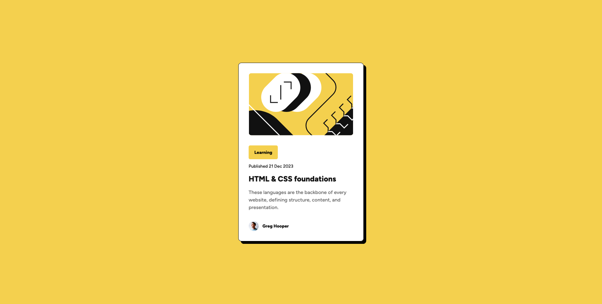

# Frontend Mentor - Blog preview card solution

This is a solution to the [Blog preview card challenge on Frontend Mentor](https://www.frontendmentor.io/challenges/blog-preview-card-ckPaj01IcS). Frontend Mentor challenges help you improve your coding skills by building realistic projects.

## Table of contents

- [Frontend Mentor - Blog preview card solution](#frontend-mentor---blog-preview-card-solution)
  - [Table of contents](#table-of-contents)
  - [Overview](#overview)
    - [The challenge](#the-challenge)
    - [Screenshot](#screenshot)
    - [Links](#links)
  - [My process](#my-process)
    - [Built with](#built-with)
    - [What I learned](#what-i-learned)
    - [Useful resources](#useful-resources)

## Overview

### The challenge

Users should be able to:

- See hover and focus states for all interactive elements on the page

### Screenshot



### Links

- Solution URL: [Frontend Mentor]()
- Live Site URL: [Github Pages](https://www.ckharrison.github.io/blog-preview-card)

## My process

### Built with

- Semantic HTML5 markup
- CSS custom properties
- Flexbox
- Mobile-first workflow

### What I learned

The main thing I learned on this project was how to create a css custom property(variable) to hold multiple rules at once. I noticed I was duplicating a lot of code across the different parts of text on the card component. So I created 4 custom properties according to the Figma style guide that had four different text presets.
I'm not sure how readable the custom properties are, so let me know what you think! I keep going back and forth between liking the removal of duplication, and the relative clutter of the all in one font property.

I also learned how to use variable fonts, I hadn't used those before so it was a neat thing to learn. I can see how they could be useful, I'll have to continue using them in the future so I can figure out all of the niche advantages they provide over the more classic methods of font deliver.

To see how you can add code snippets, see below:

```css
--text-preset-1: var(--font-weight-bold) var(--font-size-large) / var(--default-line-height) var(--font-family);

.blog-title {
  color: var(--color-gray-950);
  font: var(--text-preset-1);
  font-size: 1.5rem;
}
```

### Useful resources

- [CSS Tips and Tricks - Variable Fonts](https://css-tricks.com/newsletter/259-how-to-use-variable-fonts/) - This newsletter article was a great resource describing how variable fonts work and the advantages of using them.
- [CSS Tips and Tricks - Font Property](https://css-tricks.com/snippets/css/font-shorthand/) - This helped me understand the shrothand for the font property, so I could use a custom property that captured all of these options.

- Website - [Chris Harrison](https://www.charrison.dev)
- Frontend Mentor - [@CKHarrison](https://www.frontendmentor.io/profile/CKHarrison)
